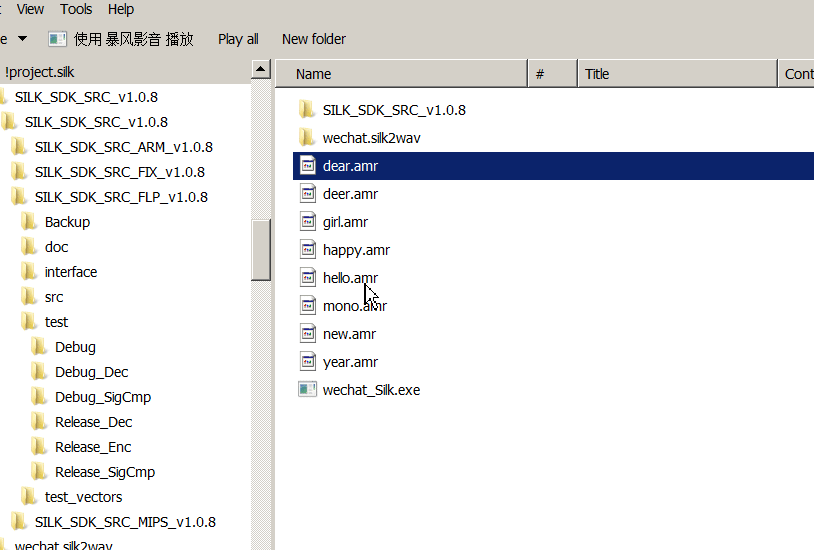

# wechat_silk
Wechat SILK to wav 

`@2016-02-07`  

  

Android 6.* 版本的微信，语音使用的编码是  SILK  
这个软件实现解码，并输出为 wav 文件  

# 使用方法  

方法1：  	
> 将想要的 amr 文件复制到你的电脑上，选中你想要解码的 amr 文件（一个或者多个），拖拽到 `wechat_silk.exe` 上面即可. 
> 举例来说明，如果你选中了`E:\hi.amr` 和 `E:\mono.amr`，拖拽到 `wechat_silk.exe` 上,
> 会输出两个文件 `E:\hi.amr.wav` 和 `E:\mono.amr.wav.` ，这两个文件就是你想要的了.  

方法2：  
> 上面是第一种用法，另一种用法其实是使用命令行。如果你会 CMD ，那么这个程序可以接受任何数量个参数：  
> `wechat_silk.exe  <file1.amr>  <file2.amr> …`  
> 当然，也支持 file expansion  
> `wechat_silk.exe  *.amr`   

# build 

1. fork SILK SDK: [github link](https://github.com/gaozehua/SILKCodec/tree/master/SILK_SDK_SRC_FLP)  

2. replace `test/Decoder.c`  in SILK SDK  

3. Link with `setargv.obj` for `file expansion` parsing.  

Enjoy.

